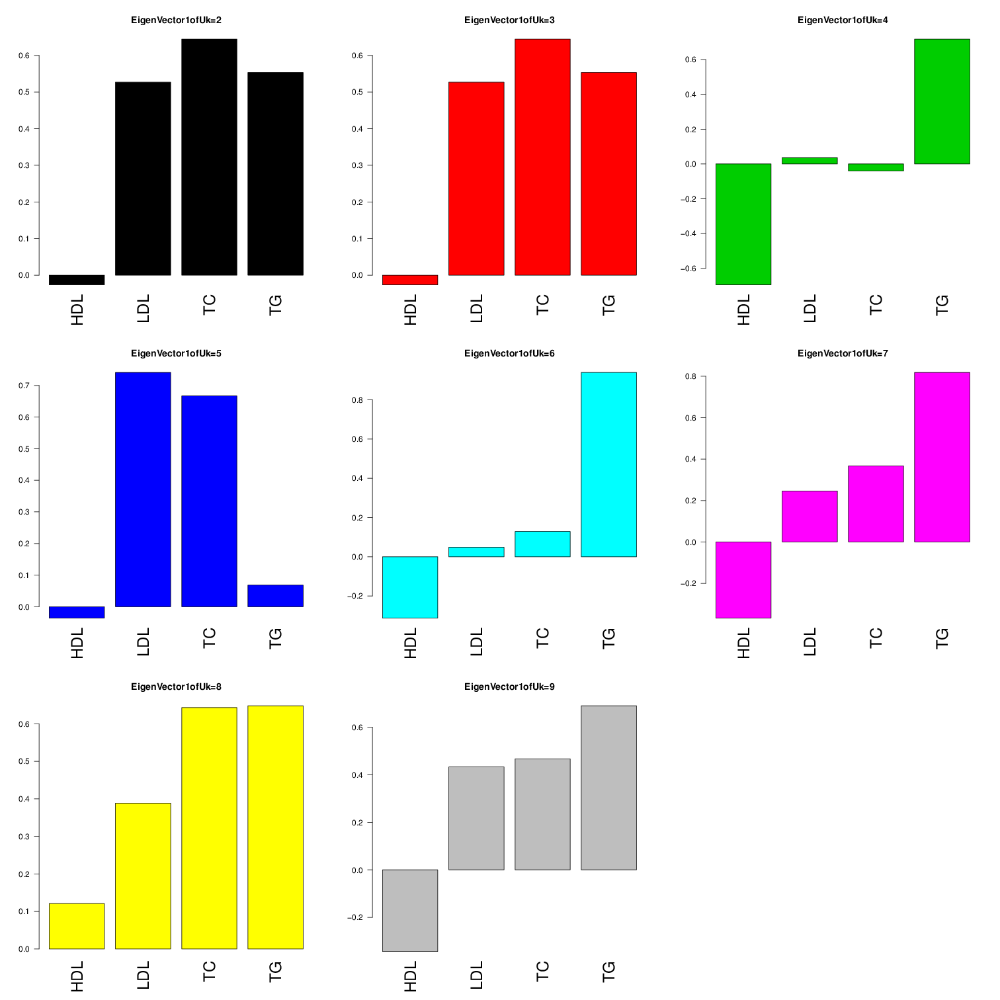

Creating dataset:

```{r global_options, include=FALSE}
knitr::opts_chunk$set(fig.width=12, fig.height=8, fig.path='~/Dropbox/PhDThesis/Figures/', warning=FALSE, message=FALSE,cache=T)
```


```{r,echo=F,eval=FALSE}
setwd("~/Dropbox/global_lipids/")

files<-scan(pipe('ls Mc*'), what='char');R=length(files);
data <- lapply(files, function(i) {print(i); read.table(i, header=T)})
head(data[[1]])
uniqegenes<-unique(unlist(lapply(data, function(i) paste(i[,1], i[,2], sep='_'))))##concatenate, unlist, and find unique gene-snp pairs
length(uniqegenes)

betamatched<-sapply(data,function(i) i[match(uniqegenes, paste(i[,1], i[,2], sep='_')),"beta"]) 
head(betamatched)


betamatched.with.allele<-lapply(data,function(i) {cbind(i[match(uniqegenes, paste(i[,1], i[,2], sep='_')),"A1"],i[match(uniqegenes, paste(i[,1], i[,2], sep='_')),"beta"]) })
betamatched.with.allele
m=cbind(betamatched.with.allele[[1]],betamatched.with.allele[[2]],betamatched.with.allele[[3]],betamatched.with.allele[[4]])

m=na.omit(m)
ref=m[,1]##make the reference allele HDL allele 1
switch.func=function(allele,ref,x){if(allele!=ref) x=-1*x; return(x)}

hdl=m[,2]
ldl=sapply(seq(1:nrow(m)),function(i){switch.func(allele=m[i,3],ref=ref[i],x=m[i,4])})
tc=sapply(seq(1:nrow(m)),function(i){switch.func(allele=m[i,5],ref=ref[i],x=m[i,6])})
tg=sapply(seq(1:nrow(m)),function(i){switch.func(allele=m[i,7],ref=ref[i],x=m[i,8])})

signed.beta=cbind(hdl,ldl,tc,tg);colnames(signed.beta)=c("HDL","LDL","TC","TG")


bm=data.frame(list(uniqegenes,betamatched),stringsAsFactors = F)
file2=c("hgposition",files)
colnames(bm)=file2
write.table(bm,"globallipids_betahat.txt",col.names=T)##matrix of standardized betahats


se_matched<-sapply(data,function(i) i[match(uniqegenes, paste(i[,1], i[,2], sep='_')),"se"]) 
head(se_matched)
s=na.omit(se_matched)


sm=data.frame(list(uniqegenes,sm),stringsAsFactors = F)
write.table(sm,"globallipids_sehat.txt",col.names=T)##matrix of standardized standarderrors

b.hat=na.omit(read.table("globallipids_betahat.txt",header=TRUE))

signed.z=signed.beta/s
sz=data.frame(list(b.hat[,1],signed.z),stringsAsFactors = F)
sz=data.frame(signed.z,stringsAsFactors = F)
rownames(sz)=b.hat[,1]

#colnames(sz)[1]="hgposition"

write.table(sz,"globallipids_z.stat.txt",col.names=T)##matrix of standardized standardz
######
```

Now, run script.

```{r,echo=FALSE}

source("~/matrix_ash/R/main.R")
source("~/matrix_ash/R/sarah's_mixem.R")
source("~/matrix_ash/R/mixEm.R")
library("SQUAREM")
library("mvtnorm")
library("bigmemory")

# b.hat=na.omit(read.table("globallipids_betahat.txt",header=TRUE))
# s.hat=na.omit(read.table("globallipids_sehat.txt",header=TRUE))
# rownames(b.hat)=rownames(s.hat)=b.hat[,1]
# beta_hat=b.hat[,-1]
# se_hat=s.hat[,-1]
# z.stat=beta_hat/se_hat

z.stat=read.table("globallipids_z.stat.txt",header = TRUE)

v.j=matrix(rep(1,ncol(z.stat)*nrow(z.stat)),ncol=4,nrow=nrow(z.stat))
max.z=cbind(z.stat,maxz=apply(z.stat,1,function(x){max(abs(x))}))
max.z.sort=max.z[order(max.z[,"maxz"],decreasing=T),]
```

Here's the script:
```{r,eval=FALSE,echo=FALSE}
###use these strongest 1000 to build covariance matrices
maxes=max.z.sort[1:1000,-5]
#write.table(maxes,"~/Dropbox/maxzlipid1000.txt",col.names=FALSE,row.names=FALSE)


#sfa -gen ./maxzlipid1000.txt -g 1000 -n 4 -o lipid_z1000 i -k 5
factor.mat=as.matrix(read.table("~/Dropbox/global_lipids//lipid_z1000_F.out"))
lambda.mat=as.matrix(read.table("~/Dropbox/global_lipids//lipid_z1000_lambda.out"))


A="lipid_data_signedz"

cov=compute.covmat(b.gp.hat = z.stat,sebetahat = v.j,Q =5, t.stat=maxes,lambda.mat=lambda.mat,P=3,A="lipid_data", factor.mat = factor.mat,bma = TRUE)

compute.hm.train.log.lik(train.b = z.stat[1:40000,],se.train = v.j[1:40000,],covmat = cov,A)

###compute posteriors on maxes

pis=readRDS(paste0("pis",A,".rds"))$pihat

b.test=maxes[1:10000,]
se.test=v.j[1:10000,]
weightedquants=lapply(seq(1:10000),function(j){total.quant.per.snp.new(j,cov,b.gp.hat=b.test,se.gp.hat = se.test,pis,A,checkpoint = FALSE)})
```


Let's check our calculations:
```{r,echo=FALSE,eval=FALSE}
A="lipid_data_signedz"
j=109668
t=z.stat;
s.j=z.stat/z.stat;
covmat=readRDS(paste0("covmat",A,".rds"))
pis=readRDS(paste0("~/Dropbox/global_lipids/pis",A,".rds"))$pihat

all.arrays=post.array.per.snp(j=j,covmat = covmat,b.gp.hat = t,se.gp.hat = s.j)

b.mle=as.vector(t(t[j,]))##turn i into a R x 1 vector
V.gp.hat=diag(s.j[j,])^2
V.gp.hat.inv <- solve(V.gp.hat)
k=17

U.gp1kl <- (post.b.gpkl.cov(V.gp.hat.inv, covmat[[k]]))
mu.gp1kl <- as.array(post.b.gpkl.mean(b.mle, V.gp.hat.inv, U.gp1kl))
#(all.arrays$post.means[k,])
plot(all.arrays$post.means[k,],mu.gp1kl)

##Now, check to make sure weighting is correct
post.means=as.matrix(read.table(paste0("~/Dropbox/global_lipids/",A,"posterior.means.txt"))[,-1])
lfsr=as.matrix(read.table(paste0("~/Dropbox/global_lipids/",A,"lfsr.txt"))[,-1])
log.lik.snp=log.lik.func(b.mle,V.gp.hat,covmat)
log.lik.minus.max=log.lik.snp-max(log.lik.snp)
#log.pi=log(pis)
#s=log.lik.minus.max+log.pi
exp.vec=exp(log.lik.minus.max)
post.weights=t(exp.vec*pis/sum(exp.vec*pis))


plot(post.means[j,],post.weights%*%all.arrays$post.means)

post.ups=post.weights%*%all.arrays$post.ups
post.downs=post.weights%*%all.arrays$post.downs
tail.probs=rbind(post.ups,post.downs)
plot(lfsr[j,],apply(tail.probs,2,function(x){1-max(x)}))
```


Compare to univariate results:
 
```{r,eval=FALSE,echo=FALSE}
library('ashr')


train.z=z.stat[1:40000,]
train.v=v.j[1:40000,]


t.fit=b.test
v.fit=se.test

univariate.ash.pm=matrix(nrow=nrow(t.fit),ncol=ncol(t.fit))
univariate.ash.lfsr=matrix(nrow=nrow(t.fit),ncol=ncol(t.fit))

for(x in 1:4){

b=ash(betahat=train.z[,x],sebetahat=train.v[,x],mixcompdist="normal")##fit weights on random data
g.fix=b$fitted.g
max.z.fit=ash(betahat=t.fit[,x], sebetahat=v.fit[,x],g=g.fix,control=list(maxiter=0))
univariate.ash.pm[,x]=max.z.fit$PosteriorMean
univariate.ash.lfsr[,x]=max.z.fit$lfsr
}


write.table(univariate.ash.pm,file="lipids_univariateashtspec.pm.txt")
write.table(univariate.ash.lfsr,file="lipids_univariateashtspec.lfsr.txt")
```

We can see that our method is more powerful than both univariate and multivariate approahces:

```{r power.analysis,echo=TRUE}
lf.mash=read.table("lipid_data_signedzlfsr.txt")[,-1]
lf.bma=read.table("lipid_data_signedz_bmaonlylfsr.txt")[,-1]
lf.ash=read.table("lipids_univariateashtspec.lfsr.txt")
thresh=0.05
mean(lf.mash<thresh)
mean(lf.ash<thresh)
mean(lf.bma<thresh)
```

We can also ask how many SNPs are less than the threshold in at least one subgroup:


```{r min.comp,echo=TRUE}
min.mash=apply(lf.mash,1,min);sum(min.mash<0.05)
min.bma=apply(lf.bma,1,min);sum(min.bma<0.05)
min.ash=apply(lf.ash,1,min);sum(min.ash<0.05)
```


And much better than joint method like BMA. After training on 40,000 snps and testing on a unique set of 40,000 aditional snps, we learn the test set likelihood:


```{r,eval=FALSE}

sum(log(test.lik%*%pis.train))
cat total.lik.bma.lite
-315326.50
cat total.lik.mash
 -259030.11
```


Let's look at the covariance patterns captured:
```{r covmats, echo=FALSE}
pis=readRDS("pislipid_data_signedz.rds")$pihat
pi.mat=matrix(pis,ncol=14,byrow=TRUE)
pi.bma=readRDS("pislipid_data_signedz_bmaonly.rds")$pihat
pi.bma.mat=matrix(pi.bma,ncol=5,byrow=TRUE)
par(mfrow=c(1,2))
colnames(pi.mat)=c("ID","X'X","SVD","F1","F2","F3","F4","F5","SFA_4","HDL","LDL","TC","TG","ALL")
colnames(pi.bma.mat)=c("HDL","LDL","TC","TG","ALL")
barplot(colSums(pi.mat),main='MASH',las=2)
mtext(text = "Likelihood= -259030.11")
barplot(colSums(pi.bma.mat),main='BMA',las=2)
mtext(text = "Likelihood= -315326.50")
```
We can see that the new matrices occupy a majority of the weight, whereas BMA is limited by the 'consistent' 

```{r}
sum(colSums(pi.mat[,1:9]))
colSums(pi.bma.mat)[5]
```

In fact, let's examine the patterns.

.
.
```{r,echo=FALSE}
A="lipid_data_signedz"
covmat=readRDS(paste0("covmat",A,".rds"))
library(gplots)
library(ggplot2)
colnames(z.stat)=c("HDL","LDL","TC","TG")
# for(k in 2:9){
# 
#   x=covmat[[k]]
#   colnames(x)=colnames(z.stat)
#   rownames(x)=colnames(z.stat)
# heatmap.2(x/max(diag(covmat[[k]])),Rowv=FALSE,Colv=FALSE,symm=TRUE,key=ifelse(k==2,TRUE,FALSE),dendrogram="none",density="none",trace="none",col=redblue(256),main=paste0("HeatMapofNormalizedUk",k),cexRow=2,cexCol=2,symbreaks=T,symkey = T)
# }
 

# 
# for(k in 2:9){
#    ifile <- paste0(k,'_allheatmaps.png')
#     pdf(ifile)
#   x=covmat[[k]]
#   colnames(x)=colnames(z.stat)
#   rownames(x)=colnames(z.stat)
# heatmap.2(x/max(diag(covmat[[k]])),Rowv=FALSE,Colv=FALSE,symm=TRUE,dendrogram="none",density="none",trace="none",col=redblue(256),main=paste0("HeatMapofNormalizedUk",k),cexRow=0.5,cexCol=0.5,symbreaks=T,key=ifelse(k==2,TRUE,FALSE),cex)
# dev.off()
# }
# system('montage -geometry 100% -tile 3x3 ./*_allheatmaps.png ./lipiddatacompiledheatmaps.png')

# 
for(i in 2:9){
   ifile <- paste0(i,'_eigen.png')
    pdf(ifile)
#for(i in c(2:9)){
  
v=svd(covmat[[i]])$v
  colnames(v)=rownames(v)=colnames(z.stat)
max.effect=sign(v[,1][which.max(abs(v[,1]))])
barplot(max.effect*v[,1],las=2,main=paste0("EigenVector1ofUk=",i),col=i-1,cex.names=2)

dev.off()
}
system('montage -geometry 100% -tile 3x3 ./*_eigen.png ~/Dropbox/PhDThesis/Figures/compiledeigen.png')
# 
# }#main=ifelse(i!=5,paste0("EigenVector1ofUk=",i),""),ylab=ifelse(i==5,paste0("EigenVector1ofUk=",i),""),
#        # col=i-1,axisnames=ifelse(i==2,TRUE,FALSE),cex.names=ifelse(i==2,0.4,NULL))
# #if(i==5) { mtext(paste0("EigenVector1ofUk=",i))}}

```
Note that  Uk=5 and Uk=4, the most prevalent patterns by prior weight, capture strong correlations between LDL and Total Cholesterol (as seen in covariance of maxes) and inverse correlation between HDL and Triglycerides, also seen in the correlation matrix of maxes.

Do we see patterns of specificity? 
```{r,echo=FALSE}
plot_ts=function(tissuename,lfsr,curvedata,thresh=0.05,subset=1:44){
  index_tissue=which(colnames(lfsr) %in% tissuename);

  ##create a matrix showing whether or not lfsr satisfies threshold
  sigmat = lfsr <= thresh;
  sigs=which(rowSums(sigmat[,index_tissue,drop=FALSE])==length(tissuename) & rowSums(sigmat[,-index_tissue,drop=FALSE])==0)
  
   iplotCurves(curvedata[sigs,subset],chartOpts=list(curves_xlab="Tissue",curves_ylab="curvedata"))}
post.means=as.matrix(read.table(paste0("~/Dropbox/global_lipids/",A,"posterior.means.txt"))[,-1])
lfsr=lf.mash
rownames(post.means)=row.names(z.stat)

maxz=z.stat
thresh=0.05
dist=as.matrix(lfsr)<=thresh
colnames(lfsr)=colnames(z.stat)
rownames(lfsr)=rownames(z.stat)
ones=which(rowSums(dist)==1)
thresh=0.10
barplot(apply(lfsr[which(rowSums(lfsr<=thresh)==1),],2,function(x){sum(x<=thresh)}),las=2,cex.names=2,main=paste0("Number of SNPS with LFSR<",0.05," in Single subgroup"))
```

When we plot t-spec by subgroup, we see that subgroup specific effects are rare and of small magnitude because of the linear combinations present. Thus because TC is strongly correlated with all, it receives the greatest 'boost' my modest effects elsewhere and if effects are un th cusp in other tissues, TC will satisfy the threshold while the other subgroups may not.

```{r,cache=F}
library(qtlcharts)
plot_ts("HDL",lfsr=lfsr,curvedata=post.means,thresh=0.05,subset=1:4)
```

We can see that because effects in LDL and Total Cholesterol are often correlated (see high loading on Uk - 5 which captures these correlations), being 'tissue' specific in one often implies an effect that yields and lfsr close to the threshold in the other.

```{r,cache=F}

plot_ts("LDL",lfsr=lfsr,curvedata=post.means,thresh=0.05,subset=1:4)
```

```{r,cache=F}
plot_ts("TC",lfsr=lfsr,curvedata=post.means,thresh=0.05,subset=1:4)
```

```{r,cache=F}
plot_ts("TG",lfsr=lfsr,curvedata=post.means,thresh=0.05,subset=1:4)
```

```{r pairwisesharing_globallipids}
library("mashr")
post.means=as.matrix(read.table("lipid_data_signedzposterior.means.txt")[,-1])
lfsr.mash=as.matrix(read.table("lipid_data_signedzlfsr.txt"))[,-1]

se.matched=na.omit(read.table("globallipids_sehat.txt",header = T,stringsAsFactors = F)[,-1])
strain.names=c("TG","TC","LDL","HDL")
pm.mash.beta=post.means*se.matched
colnames(pm.mash.beta)=colnames(lfsr.mash)=strain.names
lfsr.mash.sig=lfsr.mash[rowSums(lfsr.mash<0.05)>0,]##only 137,223 are significant in at least one subgroup
pm.mash.sig=pm.mash.beta[rowSums(lfsr.mash<0.05)>0,]

signheatmap=compute.sharing.by.sign(lfsr.mash = lfsr.mash.sig,thresh = 0.05,pm.mash.beta = pm.mash.sig)
signheatmap[lower.tri(signheatmap)] <- NA
magheatmap=compute.mag.by.sharing(lfsr.mash = lfsr.mash.sig,thresh = 0.05,pm.mash.beta = pm.mash.sig)
magheatmap[lower.tri(magheatmap)] <- NA


library('colorRamps')
library('corrplot')
library(gplots)
library(ggplot2)

class(signheatmap)


library('lattice')

clrs <- colorRampPalette(rev(c("#D73027","#FC8D59","#FEE090","#FFFFBF",
                               "#E0F3F8","#91BFDB","#4575B4")))(64)


# FOCUS PALETTES
# Red as highlight
redfocus = c("#CB181D", "#252525", "#525252", "#737373", "#969696", "#BDBDBD", "#D9D9D9", "#F0F0F0")
 
# Green as highlight
greenfocus = c("#41AB5D", "#252525", "#525252", "#737373", "#969696", "#BDBDBD", "#D9D9D9", "#F0F0F0")
 
# Blue as highlight
bluefocus = c("#0033FF", "#252525", "#525252", "#737373", "#969696", "#BDBDBD", "#D9D9D9", "#F0F0F0")

redmono = c("#99000D", "#CB181D", "#EF3B2C", "#FB6A4A", "#FC9272", "#FCBBA1", "#FEE0D2", "#FFF5F0")
greenmono = c("#005A32", "#238B45", "#41AB5D", "#74C476", "#A1D99B", "#C7E9C0", "#E5F5E0", "#F7FCF5")
bluemono = c("#084594", "#2171B5", "#4292C6", "#6BAED6", "#9ECAE1", "#C6DBEF", "#DEEBF7", "#F7FBFF")
grey8mono = c("#000000","#252525", "#525252", "#737373", "#969696", "#BDBDBD", "#D9D9D9", "#F0F0F0")
grey6mono = c("#242424", "#494949", "#6D6D6D", "#929292", "#B6B6B6", "#DBDBDB")
library(RColorBrewer)
p=colorRampPalette(brewer.pal(9,"Blues"))(100)
g=colorRampPalette(brewer.pal(9,"Greens"))(100)


clrs=redblue
#clrs[63:64] <- "darkviolet"
lat=signheatmap
lat[lower.tri(lat)] <- NA
print(levelplot(lat,col.regions = p,xlab = "",ylab = "",colorkey = TRUE,main="PairwiseSharingBySign"))


heatmap.2(magheatmap,Rowv=FALSE,Colv=FALSE,
          symm=TRUE,dendrogram="none",density="none",trace="none",#col=redblue,
          col=blue2green,main=paste0("Pairwise Sharing by Magnitude"),
          cexRow=0.6,cexCol=2,cex.main=0.5,#breaks=seq(0.35,1,0.01),
          labCol=NA)

library('lattice')

clrs <- colorRampPalette(rev(c("#D73027","#FC8D59","#FEE090","#FFFFBF",
                               "#E0F3F8","#91BFDB","#4575B4")))(64)
#clrs[63:64] <- "darkviolet"
absmagheatmap=compute.mag.by.sharing(lfsr.mash = lfsr.mash.sig,thresh = 0.05,pm.mash.beta = abs(pm.mash.sig))
absmagheatmap[lower.tri(absmagheatmap)] <- NA
lat=absmagheatmap
lat[lower.tri(lat)] <- NA
print(levelplot(lat,col.regions = g,
                xlab = "",ylab = "",colorkey = TRUE,main="PairwiseSharingByMagnitude"))
